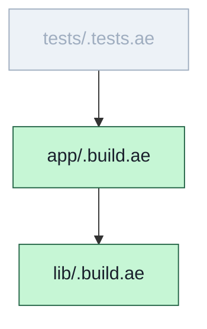

# `aeb --graph mermaid` — colouring the DAG by the last build's outcome

`aeb --graph mermaid` emits the build-file DAG as a Mermaid `graph TD`. On its
own that shows the *shape* of the graph — which is useful, but static: it reads
identically whether or not anything ever ran. When a build **has** run in the
tree, the mermaid output now overlays that run's per-node outcome onto the same
graph, so it answers a sharper question:

> what did *this* `aeb <target>` (or `--since <ref>`) actually touch, and how
> did each node go — invoked vs uninvoked, passed vs failed?

## What the colours mean

Each node is given a Mermaid class, and the block carries the matching
`classDef`s:

| Class | Colour | Meaning |
|---|---|---|
| `:::ok` | green | invoked in the last run, exited 0 |
| `:::fail` | red | invoked, exited non-zero |
| `:::uninvoked` | dimmed grey | present in the static tree, but **not** part of the last invocation (outside the `aeb <target>` / `--since` scope) |

Example, after building `app` (which deps `lib`) while `tests` was out of scope:



## Using it

```sh
aeb app/.build.ae            # (or: aeb --since main) — do a build first
aeb --graph mermaid > dag.md # colours by that build; renders inline on GitHub
```

## Behaviour that's easy to trip on

- **The colour is the LAST build, not this command.** `--graph` is a query — it
  reads the DAG and exits, it doesn't build. So the colours reflect whatever run
  most recently left markers in the tree. Re-run the build to refresh them.
- **Cold `--graph mermaid` (never built here) → plain, uncoloured graph.** No
  markers, no `classDef`s. Fully backward-compatible with the pre-colouring
  output.
- **Only mermaid is coloured.** `aeb --graph` (DOT) is never coloured — DOT is
  the pipe-to-graphviz path; colour is a Mermaid-render nicety.

## Where the data comes from

The per-node outcome is read from the driver's markers under
`target/.aeb/rc/` — one `<san>.rc` file per node aeb ran (`0` = ok, non-zero =
fail; **absent** = the node wasn't part of the run). `aeb-main` passes that
directory to `aeb-graph` as an optional argument when it exists; `mermaid_render`
classes each node from it. The node→marker filename mapping mirrors the driver's
`_san()` so a build-file path resolves to the same marker file it wrote. See
[nodes-as-subprocesses.md](nodes-as-subprocesses.md) for those markers.

## The deliberate limit — it colours a file-level DAG, it doesn't deepen it

aeb's DAG is **file-level**: nodes are dot-prefixed `.ae` build files, edges are
grepped `build.dep(...)` lines (see
[filename-is-the-route.md](filename-is-the-route.md)). The colouring overlays
the run onto that static shape; it does **not** graph control flow *inside* a
build body. There is deliberately no "which branch of the build script fired"
data — `dep(...)` is a runtime no-op used only for graph extraction, and a
node's body is arbitrary Aether aeb doesn't introspect. So "invoked vs
uninvoked" is answerable at node granularity (did this node run?), and "why did
it run" is answerable from the graph edges + `--since`, but intra-node execution
tracing is out of scope by design, not by omission.
